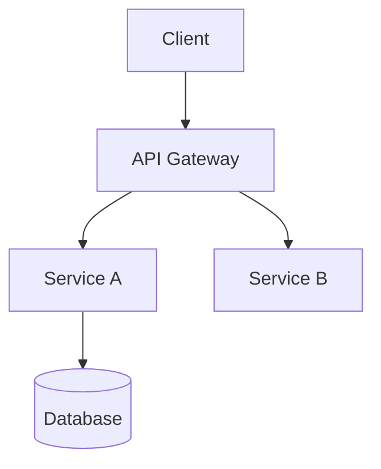
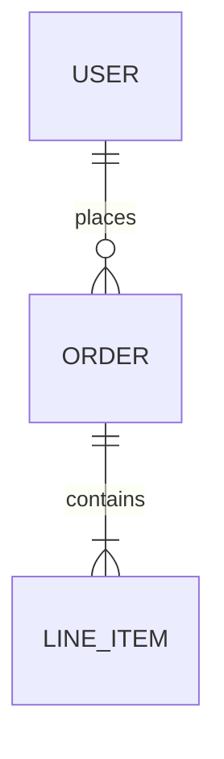

# Doc Templates Reference

Templates and structural guidance for each document type. These are starting points — adapt based on project context.

---

## README.md

```markdown
# [Project Name]

> One-sentence description of what this project does and who it's for.

## Overview

[2-3 sentences expanding on the project's purpose, the problem it solves, and any relevant context about its place in the broader system.]

## Prerequisites

- [Runtime / language version, e.g. Node.js >= 20]
- [Package manager, e.g. pnpm 9+]
- [Any required accounts or services, e.g. access to XYZ internal service]

## Getting Started

```bash
# Clone the repo
git clone [repo-url]
cd [project-name]

# Install dependencies
[install command]

# Copy environment config
cp .env.example .env
# Fill in values — see ENVIRONMENT.md for details

# Start development server
[dev command]
```

App runs at `http://localhost:[PORT]`.

## Running Tests

```bash
# Unit tests
[test command]

# With coverage
[coverage command]
```

## Project Structure

```
[abbreviated directory tree]
```

See [ARCHITECTURE.md](./ARCHITECTURE.md) for a deeper walkthrough.

## Contributing

See [CONTRIBUTING.md](./CONTRIBUTING.md).

## License

[License type] — see [LICENSE](./LICENSE).
```

---

## CONTRIBUTING.md

```markdown
# Contributing

Thanks for taking the time to contribute! This guide covers the conventions and expectations for working on [Project Name].

## Branching Strategy

We use **[trunk-based development / Gitflow / GitHub Flow]**.

- `main` — production-ready code; protected, requires PR
- `[dev/staging]` — integration branch (if applicable)
- Feature branches: `[type]/[short-description]` (e.g., `feat/user-auth`, `fix/api-timeout`)

## Commit Conventions

We follow [Conventional Commits](https://www.conventionalcommits.org/):

```
<type>(<scope>): <short description>

[optional body]
[optional footer]
```

**Common types:** `feat`, `fix`, `chore`, `docs`, `refactor`, `test`, `perf`

Examples:
- `feat(auth): add JWT refresh token support`
- `fix(api): handle 429 rate limit responses`
- `docs(readme): update setup instructions`

## Pull Requests

- Keep PRs focused — one concern per PR
- Fill out the PR template completely
- Link to the relevant issue or ticket
- PRs require [N] approval(s) before merging
- Squash-merge preferred to keep history clean

## Code Review Etiquette

**As an author:**
- Annotate complex changes with comments explaining *why*, not *what*
- Respond to all review comments before requesting re-review

**As a reviewer:**
- Distinguish blocking issues from suggestions (`nit:`, `optional:`, `blocking:`)
- Approve when the change is good enough — perfect is the enemy of merged

## Local Setup

See [README.md](./README.md) for setup instructions.
```

---

## ONBOARDING.md

```markdown
# Onboarding Guide

Welcome to [Project Name]! This guide gets you from zero to productive as quickly as possible.

## Week 1 Goals

- [ ] Dev environment set up and running
- [ ] Understand the high-level architecture
- [ ] Make your first (small) PR
- [ ] Meet the team and understand who owns what

## Environment Setup

Follow the [README](./README.md) to get the app running locally. Then:

1. **Get access to:**
   - [ ] [Repo / org]
   - [ ] [Internal tooling, e.g. Jira, Linear, Notion]
   - [ ] [Cloud console or staging environment]
   - [ ] [Secrets manager or .env values]

2. **Install recommended editor extensions:**
   - [Extension 1] — [what it does]
   - [Extension 2] — [what it does]

## Key Reading

Start here, in order:
1. [ARCHITECTURE.md](./ARCHITECTURE.md) — understand the system
2. [STATE_MANAGEMENT.md](./STATE_MANAGEMENT.md) — understand the data layer (if frontend)
3. [GOTCHAS.md](./GOTCHAS.md) — save yourself from common pitfalls

## Codebase Tour

[Walk through the main packages/directories and what lives where. Point to the most important files to understand first.]

## Who To Ask

| Area | Person / Channel |
|------|-----------------|
| Architecture decisions | [Name / #channel] |
| Design / UX | [Name / #channel] |
| Infra / DevOps | [Name / #channel] |
| Anything else | [#general or equivalent] |

## Your First Contribution

Look for issues tagged `good first issue` or ask in [#channel] for a starter task. The goal is a small, real change — not a toy PR.
```

---

## ARCHITECTURE.md

```markdown
# Architecture

## Overview

[2-3 sentences describing what this system does at a high level and the key architectural choices that define it.]

## System Diagram

[Include a diagram here — Mermaid, ASCII, or an embedded image. Even a rough one is better than none.]



## Key Components

### [Component 1]
**Responsibility:** [What it owns]  
**Tech:** [Stack]  
**Entry point:** `[path/to/main/file]`

### [Component 2]
...

## Data Flow

[Describe the primary request/data flow through the system. A numbered list or sequence diagram works well here.]

1. User action triggers [X]
2. [X] calls [Y] via [protocol/method]
3. [Y] reads/writes from [data store]
4. Response flows back through [path]

## Key Technical Decisions

| Decision | What was chosen | Why |
|----------|----------------|-----|
| [e.g. State management] | [Zustand] | [Lightweight, no boilerplate, collocated with components] |
| [e.g. Data fetching] | [TanStack Query] | [Server state caching, deduplication, background refetch] |

See [DECISIONS.md](./DECISIONS.md) for the full decision record.

## External Dependencies

| Service | Purpose | Owner |
|---------|---------|-------|
| [e.g. Auth0] | Authentication | [Team/person] |
| [e.g. Datadog] | Observability | [Team/person] |

## What's Out of Scope

[Explicitly call out what this system does NOT do, to prevent scope creep and confusion.]
```

---

## DATA_MODEL.md

```markdown
# Data Model

## Entities

### [Entity Name]
| Field | Type | Description |
|-------|------|-------------|
| `id` | `uuid` | Primary key |
| `[field]` | `[type]` | [Description] |

### [Entity Name 2]
...

## Relationships

[Describe how entities relate. An ER diagram is ideal here.]



## Key Data Flows

### [Flow Name, e.g. "User Authentication"]
1. [Step]
2. [Step]

## Schema Conventions

- Primary keys: `uuid` by default
- Timestamps: `created_at`, `updated_at` on all tables (UTC)
- Soft deletes: `deleted_at` nullable timestamp (where applicable)
- Naming: `snake_case` for columns, `PascalCase` for entity names in code
```

---

## DESIGN_SYSTEM.md

```markdown
# Design System

## Philosophy

[1-2 sentences: what does this design system optimize for? Consistency? Developer speed? Brand fidelity?]

## Token Structure

Tokens live in `[path/to/tokens]`. They follow a two-tier system:

- **Primitive tokens** — raw values: `color.blue.500 = #3B82F6`
- **Semantic tokens** — intent-based aliases: `color.action.primary = color.blue.500`

Always use semantic tokens in components. Never reference primitive tokens directly in component code.

## Component Hierarchy

```
Primitives (Button, Input, Text, Icon)
  └── Compositions (FormField, Card, Modal)
        └── Patterns (LoginForm, DataTable, NavBar)
```

## When to Use What

| Use case | Component | Notes |
|----------|-----------|-------|
| Call to action | `<Button variant="primary">` | |
| Destructive action | `<Button variant="destructive">` | Confirm dialog required |
| Form inputs | `<FormField>` wrapper | Handles label + error state |

## Adding New Components

1. Check if an existing component can be extended
2. Discuss with the design team before creating net-new patterns
3. Add to Storybook before shipping
4. Document token usage and variant rationale
```

---

## STATE_MANAGEMENT.md

```markdown
# State Management

## The Split: Server State vs. Client State

| Type | Tool | Lives in | Examples |
|------|------|----------|---------|
| Server state | [TanStack Query / SWR / etc.] | Query cache | User profile, list data, API responses |
| Client state | [Zustand / Redux / Context] | Store | UI state, modals, selected items, auth session |

**Rule of thumb:** If it came from an API, it's server state. If it only exists in the UI, it's client state.

## Store Structure

Stores live in `[path/to/stores/]`. Each store owns one domain:

```
stores/
├── authStore.ts       # Auth session, user identity
├── uiStore.ts         # Global UI state (modals, drawers, toasts)
└── [domain]Store.ts   # Domain-specific client state
```

## Naming Conventions

- Store files: `[domain]Store.ts`
- State selectors: `use[Domain]Store(state => state.[field])`
- Actions: imperative verbs — `setUser`, `openModal`, `resetFilters`

## Query Conventions

- Query keys: `[resource, id?, filters?]` — e.g., `['users', userId]`
- Mutations always invalidate the relevant query cache on success
- Avoid `enabled: false` hacks — prefer derived state

## What NOT to Put in Global State

- Form state (use local state or a form library)
- Transient hover/focus states
- Data that's already in the query cache
```

---

## MONOREPO.md

```markdown
# Monorepo Structure

## Workspace Layout

```
[repo-root]/
├── apps/
│   └── [app-name]/          # Deployable applications
├── packages/
│   ├── ui/                  # Shared component library
│   ├── utils/               # Shared utilities
│   └── [other-package]/
├── [nx.json / pnpm-workspace.yaml / etc.]
└── package.json
```

## Package Ownership

| Package | Purpose | Owner |
|---------|---------|-------|
| `apps/[name]` | [Description] | [Team] |
| `packages/ui` | Shared component library | [Team] |
| `packages/utils` | Shared utilities | [Team] |

## Dependency Rules

- Apps can import from `packages/`
- Packages must NOT import from `apps/`
- `packages/ui` must NOT import from other packages (keeps it portable)
- Circular dependencies are banned — enforced by [NX / ESLint module boundaries]

## Running Commands

```bash
# Run command in a specific package
[nx run / pnpm --filter] [package-name] [command]

# Run across all packages
[nx run-many / pnpm -r] [command]

# Check what's affected by your changes
nx affected --target=[test/build/lint]
```

## Adding a New Package

1. Scaffold with `[generator command]`
2. Define its boundary tags in `project.json`
3. Document its purpose in this file
```

---

## RUNBOOK.md

```markdown
# Runbook

Operational procedures for deploying, rolling back, and handling incidents.

## Deployment

### Standard Deploy

```bash
[deploy command or CI/CD trigger description]
```

Deployment typically takes [N] minutes. Monitor progress in [dashboard link / CI/CD tool].

### Pre-deploy Checklist

- [ ] All tests passing on `main`
- [ ] No open incidents in [monitoring tool]
- [ ] Relevant stakeholders notified (for major changes)

### Post-deploy Verification

- [ ] [Key health check or smoke test]
- [ ] Error rate nominal in [Datadog / Sentry / etc.]
- [ ] [Critical user flow] working in production

## Rollback

### Automatic Rollback
[Describe if CI/CD auto-rolls back on failure — when and how]

### Manual Rollback

```bash
[rollback command]
```

Or via [CI/CD tool]: navigate to the previous successful deployment and trigger a redeploy.

## Incident Response

### Severity Levels

| Level | Definition | Response Time |
|-------|-----------|---------------|
| P0 | Production down / data loss | Immediate |
| P1 | Major feature broken | < 1 hour |
| P2 | Degraded performance | < 4 hours |
| P3 | Minor issue | Next business day |

### Response Steps

1. **Acknowledge** the incident in [#incidents channel]
2. **Assess** severity and impact
3. **Mitigate** — rollback, feature flag off, or hotfix
4. **Communicate** status to stakeholders
5. **Resolve** and confirm via monitoring
6. **Post-mortem** for P0/P1 within 48 hours

## Common Issues

### [Issue Type, e.g. "High error rate"]
**Symptoms:** [What you'd observe]  
**Likely cause:** [Root cause]  
**Fix:** [Steps to resolve]
```

---

## ENVIRONMENT.md

```markdown
# Environment Variables

Never commit actual values. Use [.env.example / secrets manager] to get the values you need.

## Required Variables

| Variable | Description | Where to get it |
|----------|-------------|----------------|
| `DATABASE_URL` | Postgres connection string | [1Password / team lead / etc.] |
| `AUTH_SECRET` | JWT signing secret | Generate with `openssl rand -base64 32` |
| `[VAR_NAME]` | [What it does] | [Where to get it] |

## Optional / Feature-Flagged Variables

| Variable | Default | Description |
|----------|---------|-------------|
| `FEATURE_[FLAG]` | `false` | Enables [feature name] |
| `LOG_LEVEL` | `info` | One of: `debug`, `info`, `warn`, `error` |

## Environment-Specific Notes

### Local Development
Use `.env.local` (gitignored). Copy from `.env.example` and fill in values.

### Staging
Variables managed in [CI/CD tool / cloud console]. Access via [link or instruction].

### Production
Variables managed in [CI/CD tool / cloud console]. Changes require [approval process].
```

---

## CHANGELOG.md

```markdown
# Changelog

All notable changes to this project will be documented in this file.

Format follows [Keep a Changelog](https://keepachangelog.com/en/1.0.0/), versioning follows [Semantic Versioning](https://semver.org/).

## [Unreleased]

### Added
- [New feature]

### Fixed
- [Bug fix]

---

## [x.y.z] — YYYY-MM-DD

### Added
- [Feature description]

### Changed
- [Change description]

### Fixed
- [Fix description]

### Deprecated
- [Deprecation notice]

### Removed
- [Removed feature]
```

---

## GOTCHAS.md

```markdown
# Gotchas

Non-obvious things about this codebase that will save you time. Add to this freely.

---

**[Short title of the gotcha]**  
[Explanation of what the behavior is and why it exists. Be candid.]  
💡 *[What to do instead, or how to work with it]*

---

**Example format:**  
**This API returns 200 even on errors**  
The [XYZ] endpoint always responds with HTTP 200. Actual success/failure is in `response.data.status`. This is a legacy decision we haven't been able to change.  
💡 *Always check `data.status === 'ok'` before assuming success.*

---

[Add more gotchas here as you discover them]
```

---

## DOCS_REGISTRY.md

```markdown
# Docs Registry

Single source of truth for what each doc owns. Use this to resolve "where does this topic live?" and to catch drift when two docs start covering the same thing.

## Ownership Map

| Doc | Owns (source of truth for...) | Maps to code paths | Origin | Cadence | Last Reviewed | Reviewer |
|-----|------------------------------|--------------------|--------|---------|--------------|----------|
| `README.md` | Project overview, local setup, how to run/test | `package.json`, root config files | Generated | On major setup changes | [DATE] | [NAME] |
| `ARCHITECTURE.md` | System design, component responsibilities, tech decision summary | `src/`, `apps/`, top-level structure | Generated | On architectural changes | [DATE] | [NAME] |
| `CONTRIBUTING.md` | Branching strategy, commit conventions, PR process | `.github/`, CI config | Adopted from existing | On process changes | [DATE] | [NAME] |
| `CONTEXT.md` | Project background, why it exists, key constraints and history | N/A (meta-doc) | Enrolled (custom) | Quarterly | [DATE] | [NAME] |

> **Note on custom docs:** Any doc the team values belongs here, regardless of whether it matches a standard type. The registry doesn't enforce a canonical list — it enforces ownership clarity. If a doc is in the repo and the team cares about it, it should have a row.
| `ONBOARDING.md` | New dev setup steps, who to ask, first-week goals | All of the above | Quarterly | [DATE] | [NAME] |
| `DECISIONS.md` | Why each major architectural decision was made | N/A (meta-doc) | On new decisions | [DATE] | [NAME] |
| `DATA_MODEL.md` | Entity definitions, relationships, schema conventions | `schema/`, `migrations/`, `models/` | On schema changes | [DATE] | [NAME] |
| `DESIGN_SYSTEM.md` | Component philosophy, token usage rules | `src/components/`, `tokens/` | On design system changes | [DATE] | [NAME] |
| `STATE_MANAGEMENT.md` | Client/server state split, store structure, naming conventions | `src/stores/`, query key patterns | On state architecture changes | [DATE] | [NAME] |
| `MONOREPO.md` | Package ownership, dependency rules, workspace structure | `nx.json`, `pnpm-workspace.yaml`, `packages/` | On monorepo restructuring | [DATE] | [NAME] |
| `RUNBOOK.md` | Deploy process, rollback, incident response | CI/CD config, deploy scripts | On ops changes | [DATE] | [NAME] |
| `ENVIRONMENT.md` | Env var names, purpose, and where to get values | `.env.example` | On env var changes | [DATE] | [NAME] |
| `GOTCHAS.md` | Known footguns and non-obvious behaviors | Codebase-wide | Ongoing (add freely) | [DATE] | [NAME] |

## Cross-Reference Table

Topics that appear in more than one doc are contradiction risks. The table below tracks intentional overlaps and designates which doc is authoritative.

| Topic | Docs that mention it | Authoritative doc |
|-------|---------------------|-------------------|
| Local setup | `README.md`, `ONBOARDING.md` | `README.md` (ONBOARDING links to it) |
| Tech stack summary | `README.md`, `ARCHITECTURE.md` | `ARCHITECTURE.md` (README gives one-liner) |
| [Add others as they emerge] | | |

If a topic appears here with no designated authoritative doc, that's a drift risk — resolve it.

## Review Cadences

| Cadence | Docs |
|---------|------|
| Every PR (auto-flagged) | `ENVIRONMENT.md`, `DATA_MODEL.md`, `STATE_MANAGEMENT.md`, `RUNBOOK.md` |
| On architectural changes | `ARCHITECTURE.md`, `DECISIONS.md`, `MONOREPO.md` |
| Quarterly | `ONBOARDING.md`, `CONTRIBUTING.md`, `DESIGN_SYSTEM.md` |
| Ongoing / freeform | `GOTCHAS.md` |
```

---

## .github/workflows/docs-check.yml

```yaml
name: Docs Check

on:
  pull_request:
    branches:
      - main

jobs:
  docs-check:
    runs-on: ubuntu-latest
    permissions:
      pull-requests: write
      contents: read

    steps:
      - name: Checkout
        uses: actions/checkout@v4
        with:
          fetch-depth: 0

      - name: Get changed files
        id: changed
        run: |
          git diff --name-only origin/main...HEAD > changed_files.txt
          cat changed_files.txt

      - name: Map changes to docs
        id: map
        run: |
          FLAGGED=""

          check() {
            local pattern="$1"
            local doc="$2"
            local reason="$3"
            if grep -qE "$pattern" changed_files.txt; then
              FLAGGED="${FLAGGED}\n- [ ] \`${doc}\` — ${reason}"
            fi
          }

          # Adjust these patterns to match your actual project structure
          check "src/stores/"              "STATE_MANAGEMENT.md"   "stores/ was modified"
          check "src/components/|tokens/"  "DESIGN_SYSTEM.md"      "components or tokens changed"
          check "\.env|env\.example"       "ENVIRONMENT.md"        ".env or env.example changed"
          check "Dockerfile|docker-compose|deploy" "RUNBOOK.md"   "deploy config changed"
          check "nx\.json|pnpm-workspace|turbo\.json" "MONOREPO.md" "monorepo config changed"
          check "schema/|migrations/|models/" "DATA_MODEL.md"     "schema or migrations changed"
          check "package\.json"            "ARCHITECTURE.md"       "dependencies changed"

          # Custom docs — add mappings for any project-specific docs enrolled in the ecosystem
          # check "src/|docs/"             "CONTEXT.md"            "project context may need updating"
          # check "src/|personas/"         "PERSONAS.md"           "personas doc may need updating"

          echo "flagged=$FLAGGED" >> $GITHUB_OUTPUT

      - name: Post PR comment
        if: steps.map.outputs.flagged != ''
        uses: actions/github-script@v7
        with:
          script: |
            const flagged = `${{ steps.map.outputs.flagged }}`;
            const body = [
              "## 📋 Docs Check",
              "",
              "These docs may be affected by this PR. Review each one and either update it or check it off to confirm it's still accurate.",
              "",
              flagged,
              "",
              "> This check never blocks merging — it's a prompt, not a gate.",
              "> Update [DOCS_AUDIT_LOG.md](../DOCS_AUDIT_LOG.md) after reviewing."
            ].join("\n");

            await github.rest.issues.createComment({
              owner: context.repo.owner,
              repo: context.repo.repo,
              issue_number: context.issue.number,
              body
            });

      - name: No docs flagged
        if: steps.map.outputs.flagged == ''
        run: echo "✅ No docs flagged for this PR."
```

> **After generating this file**, tell the user:
> "You'll need to add a `GITHUB_TOKEN` with `pull-requests: write` permission — this is usually available by default in GitHub Actions, but check your repo settings if the comment step fails. Also review the path patterns in the `check()` calls and adjust them to match your actual directory structure."

---

## DOCS_AUDIT_LOG.md

```markdown
# Docs Audit Log

Append-only log of every doc review, update, or conscious "no change needed" decision.
Never edit old entries — if something was wrong, add a new entry noting the correction.

## Log

| Date | Doc(s) | Change | Trigger | Reviewer |
|------|--------|--------|---------|----------|
| YYYY-MM-DD | `ARCHITECTURE.md` | Initial version created | Project setup | [Name] |
| YYYY-MM-DD | `STATE_MANAGEMENT.md` | Initial version created | Project setup | [Name] |
| YYYY-MM-DD | `ENVIRONMENT.md` | Added `FEATURE_X` var | PR #42 | [Name] |
| YYYY-MM-DD | `RUNBOOK.md` | Reviewed, no changes needed | PR #47 | [Name] |

## How to Use

- **When the docs-check bot flags a doc on a PR:** review it, make any needed updates, then add a row here.
- **"No changes needed" is a valid entry.** The point is to record that someone checked, not just that something changed.
- **For quarterly reviews:** add a row for each doc reviewed, even if nothing changed.
- **Date format:** ISO 8601 (`YYYY-MM-DD`).
```


---

## SPECS.md

```markdown
# Specs — [Project Name]

> This document is the canonical source of truth for what this project is, who it serves,
> and what it must do. All other docs (ARCHITECTURE, DATA_MODEL, etc.) should align with it.
> When specs change, update here first.

---

## Purpose & Goals

[Why does this project exist? What problem does it solve?]

**Success criteria:**
- [Measurable outcome 1]
- [Measurable outcome 2]

**KPIs / metrics:**
- [Metric and target]

---

## Users & Personas

### [Persona Name, e.g. "Platform Developer"]
- **Who they are:** [Description]
- **What they need:** [Core need this system addresses]
- **Technical level:** [Non-technical / technical / expert]

### [Persona Name 2]
...

---

## Functional Requirements

### Core (must-have for launch)
- [ ] [Requirement 1]
- [ ] [Requirement 2]

### Secondary (important but not launch-blocking)
- [ ] [Requirement]

### Future / Post-MVP
- [ ] [Requirement]

---

## Non-Functional Requirements

| Category | Requirement | Priority |
|----------|-------------|----------|
| Performance | [e.g. p95 response time < 200ms] | High |
| Security | [e.g. all data encrypted at rest] | High |
| Availability | [e.g. 99.9% uptime SLA] | Medium |
| Accessibility | [e.g. WCAG 2.1 AA] | Medium |
| Scalability | [e.g. support 10k concurrent users] | Low |

---

## Constraints & Boundaries

### Out of scope
- [Thing explicitly not being built]
- [Thing that will be handled by a different system]

### Technical constraints
- [e.g. Must use existing auth provider]
- [e.g. Cannot introduce new cloud vendors without approval]

### Other constraints
- [Timeline, budget, compliance, regulatory, etc.]

---

## Decisions Already Made

| Decision | What was chosen | Rationale |
|----------|----------------|-----------|
| [e.g. Auth] | [Clerk] | [Existing contract, team familiarity] |
| [e.g. Hosting] | [AWS] | [Company standard] |

See [DECISIONS.md](./DECISIONS.md) for full ADRs.

---

## Open Questions

Questions that are still unresolved and may affect design decisions:
- [ ] [Question]
- [ ] [Question]
```
